# ios-jailbreak-ssh-forensics
iOS jailbreak sonrası SSH kullanarak yapılan adli veri toplama vaka çalışması

## Genel Bakış
Bu çalışma, iOS cihazlarda yapılan adli inceleme sürecinde **ticari bir aracın (Magnet AXIOM) jailbreak ortamını tanıyamaması**
sonrasında yaşanan gerçek bir problemi ve bu probleme uygulanan **manuel çözümü** dokümante etmektedir.

Jailbreak işlemi başarıyla tamamlanmasına rağmen Magnet AXIOM tam dosya sistemi imajı alamamıştır.
Bu durum üzerine **SSH bağlantısı kurularak cihazdan manuel veri çekimi yapılmış** ve elde edilen artefaktlar
Magnet AXIOM üzerinde analiz edilmiştir.

Bu repo, **araç kısıtlamalarının manuel yöntemlerle nasıl aşılabileceğini** göstermeyi amaçlamaktadır.

---

## Çalışma Ortamı
- Cihaz: Test amaçlı iPhone  
- iOS Sürümü: 15.8.5  
- Jailbreak Aracı: 3uTools  
- Jailbreak Paket Yöneticisi: Sileo  
- SSH Paketi: OpenSSH (Procursus)  
- Adli Analiz Aracı: Magnet AXIOM  
- Bağlantı Yöntemi: iProxy + SSH (scp)  
- İşletim Sistemi: Windows   

---

## Problem Tanımı

Jailbreak işlemi başarıyla tamamlanmasına rağmen Magnet AXIOM aracı,
jailbreak ortamını algılayamamış ve tam dosya sistemi imajı alınamamıştır.

Bu nedenle otomatik acquisition süreci başarısız olmuş ve
manuel adli veri toplama yöntemlerine geçilmesi gerekmiştir.

Bu durum, ticari adli araçların her senaryoda yeterli olmayabileceğini göstermektedir.

---

## Uygulanan Yöntem (Metodoloji)

1. iOS cihaz 3uTools kullanılarak jailbreak edilmiştir  
2. Jailbreak sonrası **Sileo paket yöneticisinin otomatik olarak geldiği** gözlemlenmiştir  
3. Sileo üzerinden OpenSSH paketi kurulmuştur  
4. iOS cihaz üzerinde SSH erişimi yapılandırılmış ve **root şifresi manuel olarak belirlenmiştir**  
5. Bilgisayar tarafında iTunes, DLL bağımlılıkları ve libimobiledevice kurulmuştur  
6. iProxy kullanılarak USB üzerinden port yönlendirme yapılmıştır  
7. SSH bağlantısı kurulmuş ve cihaz dosya sistemine erişilmiştir  
8. SCP kullanılarak kritik adli artefaktlar manuel olarak çekilmiştir  
9. Elde edilen veriler Magnet AXIOM içerisine manuel olarak aktarılmıştır  
10. Artefakt bazlı adli analiz gerçekleştirilmiştir  

---

## Telefon Üzerinde SSH Yapılandırması

Jailbreak sonrası OpenSSH kurulduktan sonra SSH erişimi için **root şifresi belirlenmiştir**.

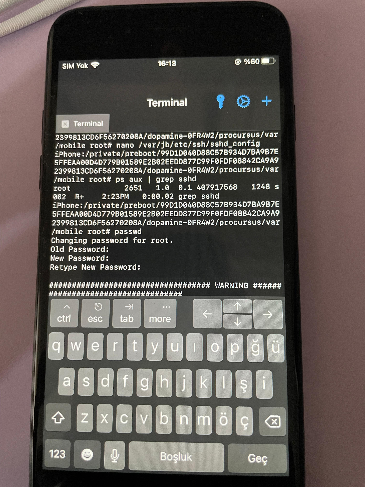

---

## 3uTools ile Jailbreak Süreci ve iCloud Doğrulama

iOS cihaz üzerinde jailbreak işlemi **3uTools** yazılımı kullanılarak gerçekleştirilmiştir.

İşlem sırasında cihazda kayıtlı olan **Apple ID (iCloud) hesabı nedeniyle kimlik doğrulama süreci** ile karşılaşılmıştır.  
Bu aşamada:

- Cihazın sahibine ait **iCloud hesabı giriş bilgileri girilmiştir**
- Apple tarafından talep edilen **doğrulama kodu (2FA)** girilerek işlem onaylanmıştır
- Kimlik doğrulama tamamlandıktan sonra jailbreak süreci başarıyla devam etmiştir

Bu adım, **Activation Lock / iCloud güvenlik mekanizmalarının** jailbreak sürecini etkileyebileceğini göstermektedir.

Doğrulama tamamlandıktan sonra cihaz üzerinde jailbreak işlemi sorunsuz şekilde uygulanmış  
ve sistem seviyesinde erişim elde edilmiştir.

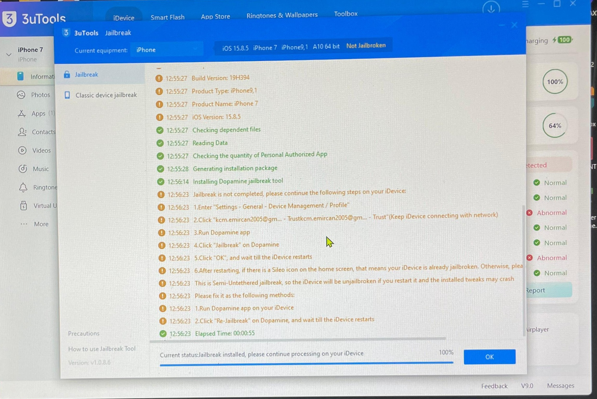

---

### 2️⃣ Jailbreak Sonrası Sileo'nun Otomatik Olarak Sisteme Entegre Edilmesi

Jailbreak süreci tamamlandıktan sonra,
paket yöneticisi olarak kullanılan **Sileo** uygulamasının
sistem tarafından otomatik olarak kurulduğu ve çalışır durumda olduğu doğrulanmıştır.

Bu durum, jailbreak aracının gerekli paket yöneticisini
otomatik olarak deploy ettiğini göstermektedir.

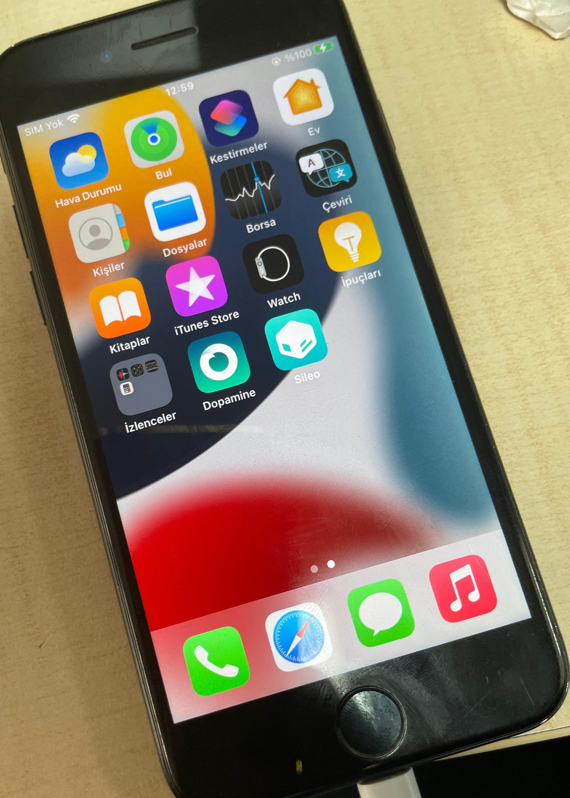

---

## OpenSSH Kurulumu (Sileo Package Manager)

SSH tabanlı adli veri erişimi sağlanabilmesi için cihazda **OpenSSH daemon servisi** aktif edilmiştir.

Jailbreak aracı bazı durumlarda OpenSSH paketini otomatik olarak deploy edebilir;  
ancak otomatik gelmeyen senaryolarda kurulum **Sileo package manager** üzerinden manuel olarak gerçekleştirilmiştir.

Kurulum adımları:

- Sileo açıldı  
- Packages sekmesinden **OpenSSH (Procursus repository)** paketi seçildi  
- Paket manuel olarak yüklendi  
- SSH servisi başlatılarak cihazda aktif hale getirildi  

Bu adım, dosya sistemi seviyesinde yetkili erişim sağlanarak  
manuel artefakt çıkarımının mümkün olmasını sağlamıştır.

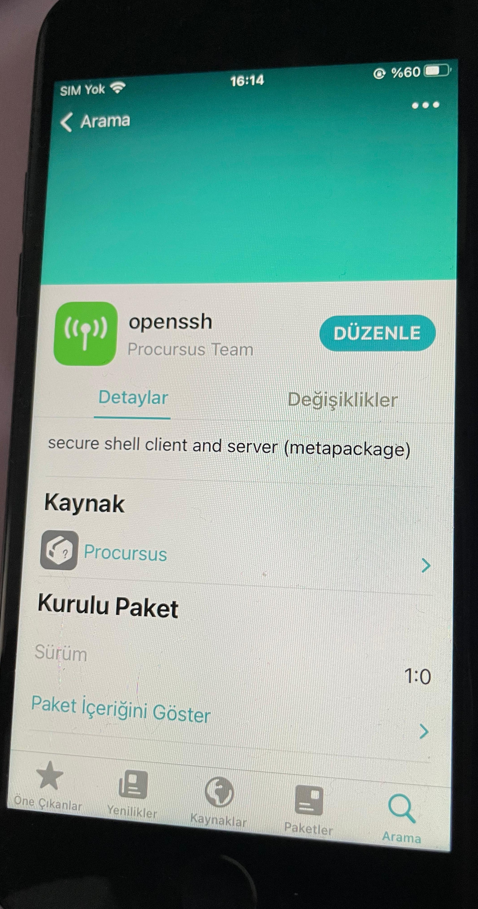

---

## iTunes Kurulumu ve Rolü

iTunes yazılımı doğrudan SSH bağlantısı için değil,  
Windows ortamında iPhone cihazının doğru şekilde tanınabilmesi  
ve gerekli **Apple Mobile Device sürücülerinin** kurulması amacıyla yüklenmiştir.

Bu sürücüler, **libimobiledevice ve iProxy araçlarının cihaz ile USB üzerinden iletişim kurabilmesi** için gereklidir.  
Dolayısıyla iTunes, SSH bağlantısına **dolaylı altyapı desteği sağlamaktadır**.

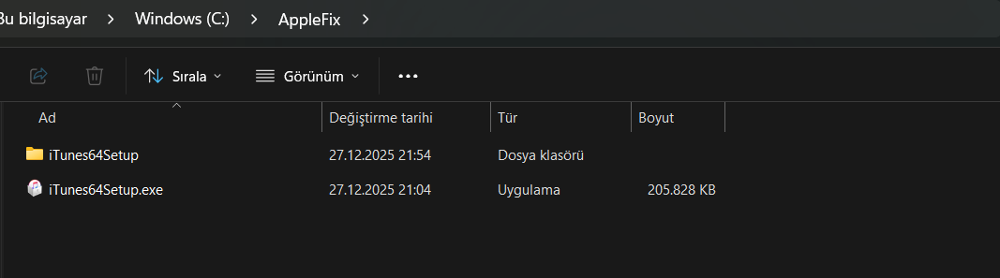

---

## Bilgisayarda iProxy ve Bağımlılık Kurulumu İçin Gerekli Dosyalar

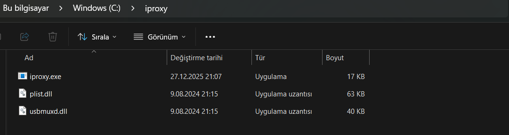

---

### iProxy Port Yönlendirme

iproxy 22** **

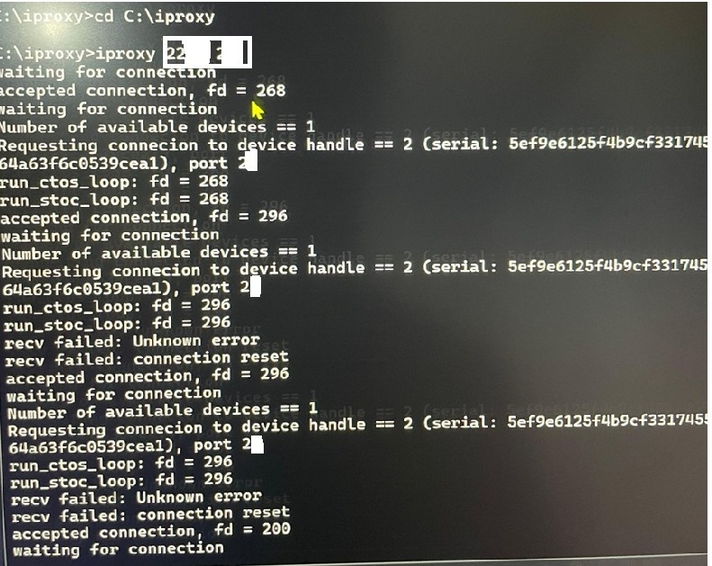

**Operational security (OPSEC) kapsamında, bağlantı detaylarının bir kısmı kasıtlı olarak anonimleştirilmiştir.**

---

### SSH ile Cihaza Bağlantı

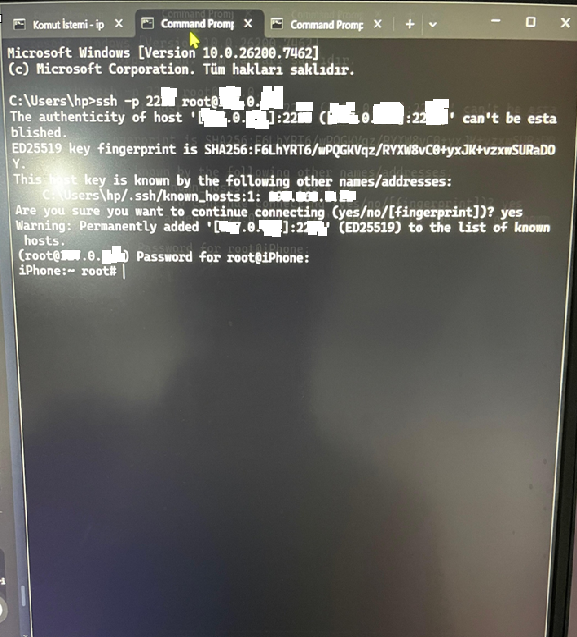

**Operational security (OPSEC) kapsamında, bağlantı detaylarının bir kısmı kasıtlı olarak anonimleştirilmiştir.**

---

### Manuel Olarak Çekilen Artefaktlar

**Fotoğraf ve medya dosyaları**
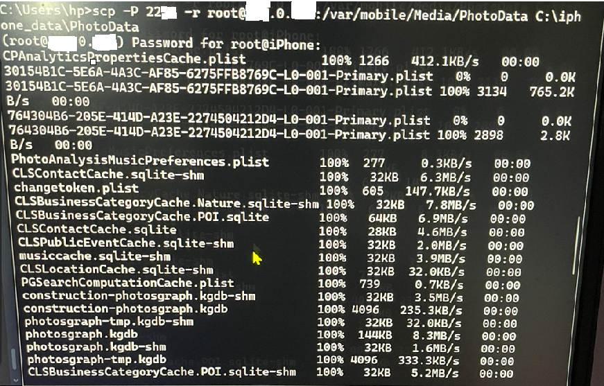

**İletişim Verileri ve Tarayıcı Verileri**
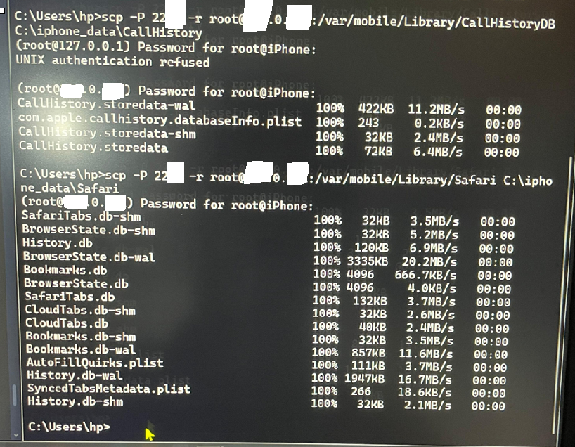

**Apple Mail Verileri**
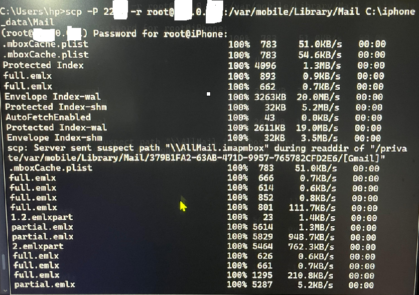

**Operational security (OPSEC) kapsamında, bağlantı detaylarının bir kısmı kasıtlı olarak anonimleştirilmiştir.**

---
### Magnet AXIOM Üzerinde Analiz

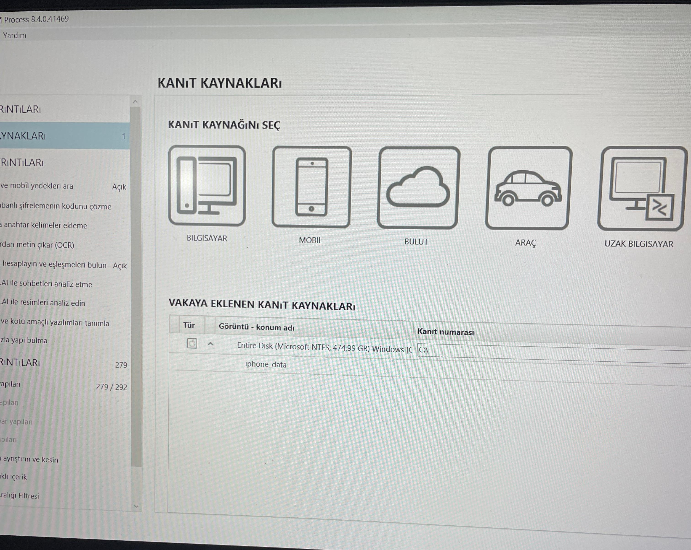

---

### Magnet AXIOM Neden Jailbreak Ortamını Tanımadı?

- Jailbreak uyumluluk problemi
- iOS güvenlik kısıtlamaları
- SSH servisinin otomatik kullanılamaması

---

### Bulgular

- Manuel artefakt analizi başarıyla yapılmıştır
- SSH ile veri çekimi geçerli bir alternatiftir
- Artefakt bazlı yaklaşım uygulanabilir

---

### Sınırlamalar

- Fiziksel imaj alınmamıştır
- Hash doğrulaması ileride eklenebilir

---

### Hukuki ve Etik Uyarı
Bu çalışmada kullanılan tüm veriler test amaçlı bir cihaza aittir.
Gerçek kişi verileri, IMEI, Apple ID veya özel bilgiler paylaşılmamıştır.

---

### Sonuç
Bu vaka çalışması, araç bağımlılığı olmadan adli inceleme yapılabileceğini
ve manuel metodolojinin kritik olduğunu göstermektedir.
